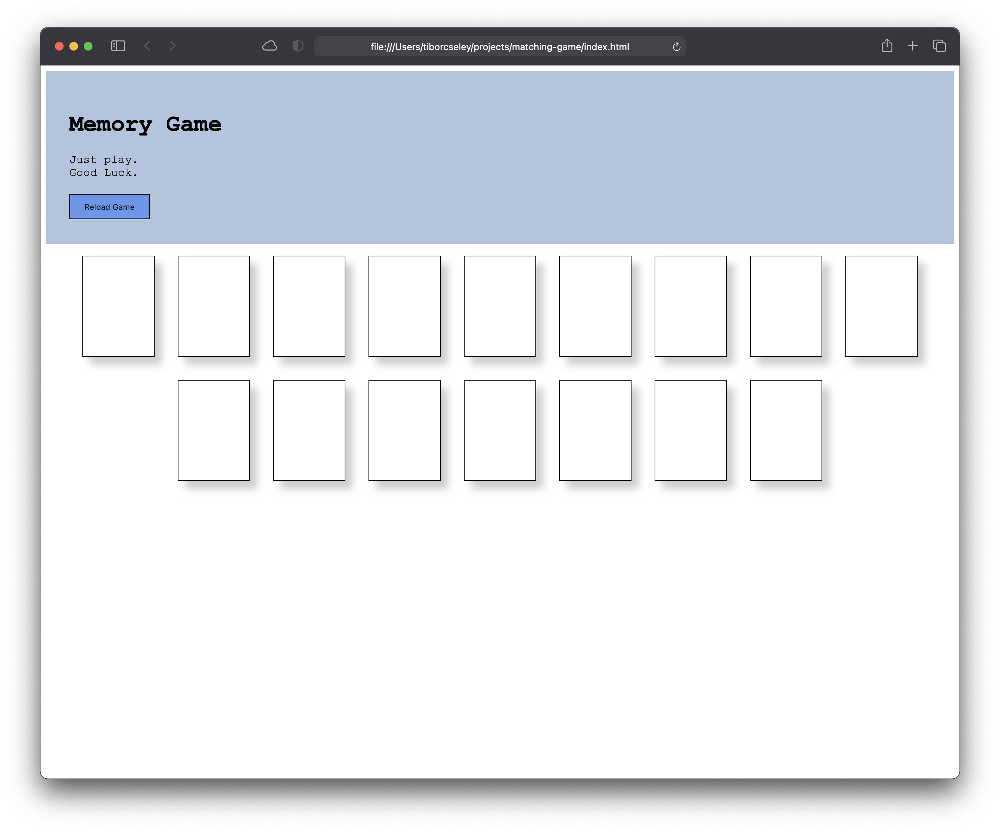

# Memory Game

This memory game uses a match the card concept to play. The player selects a card, and tries to find the matching pair. Unmatched cards are flipped back over, and matched cards stay visible to the end of the game.

Play the [Memory Game](https://tcseley.github.io/matching-game/) here.

# HOW TO PLAY

The game is easy to begin playing immediately. Click on a card and see the symbol underneath. Try and find the identical symbol on another card. Once all the cards are matched, the game will reset and the cards will be shuffled.


## Start Up Screen:




# HOW TO INSTALL


1. *`Fork`* and *`Clone`* this respository to your local machine
2. Open `index.html` in your browser to play or 
3. Open the directory in your text editor of choice to view or edit the code

The memory game is playable in the browser without an additional content to download or install.


# HOW IT WORKS
This game is based on finding all matching pairs to win. When a player selelcts one card, the symbol on that card is shown until another card is found. The second card is either a match, and the cards remain face up for the duration of the game, or it is different and both cards get flipped back over. Once this happens, you have to remember where and what card is turned face down.

```javascript
let cardData = [
  { class: "card", text: "<span>&AMP;</span>", key: "amp" },
  { class: "card", text: "<span>&numero;</span>", key: "numero" },
  { class: "card", text: "<span>&circledR;</span>", key: "cicle" },
  { class: "card", text: "<span>&para;</span>", key: "para" },
  { class: "card", text: "<span>&quest;</span>", key: "quest" },
  { class: "card", text: "<span>&Hat;</span>", key: "hat" },
  { class: "card", text: "<span>&checkmark;</span>", key: "check" },
  { class: "card", text: "<span>&ctdot;</span>", key: "dot" },
];

//Looping twice to collect 16 cards
for (let i = 0; i <= 1; i++) {
  for (let x = 0; x <= cardData.length - 1; x++) {
    let card = document.createElement("div");
    card.classList.add(cardData[x].class);
    card.innerHTML = cardData[x].text;
    card.setAttribute("data-key", cardData[x].key);
    allCards.push(card);
  }
}
```

The game is essentially a choose, compare and match strategy. The cards are presented through a series of `for` loops which takes in the data array objects, adds the necessary properties to display the cards in the main card container. Cards are then pushed back into the array and shuffled.

Event listeners are set with `click` event to check for mouse clicks inside the cards. Then `If ...else` statements look for true statements on the the `undefined` property, and comparisons to key properties.

```javascript
if (firstClick === undefined && key) {
    firstClick = event.target;
  } else if (
    firstClick !== undefined &&
    secondClick === undefined &&
    key &&
    firstClick !== event.target) {
    secondClick = event.target;
```

If two key properties match, then that is stored to a variable which is set to equal the card data array length. 

Symbols on the cards become visible through a `visibility: visible` attribute in the CSS card class. If the cards are not a match, a `setTimeout` function hides the symbol, essentially flipping over the cards; if the cards match the symbol is visible for the remainder of the game.

Once all the matches are made, a message appears and the deck is reset.

# FUTURE CONSIDERATIONS

- An advanced game mode which adds more cards could be explored.
- A difficult mode to reshuffle cards *during* game play could be interesting.