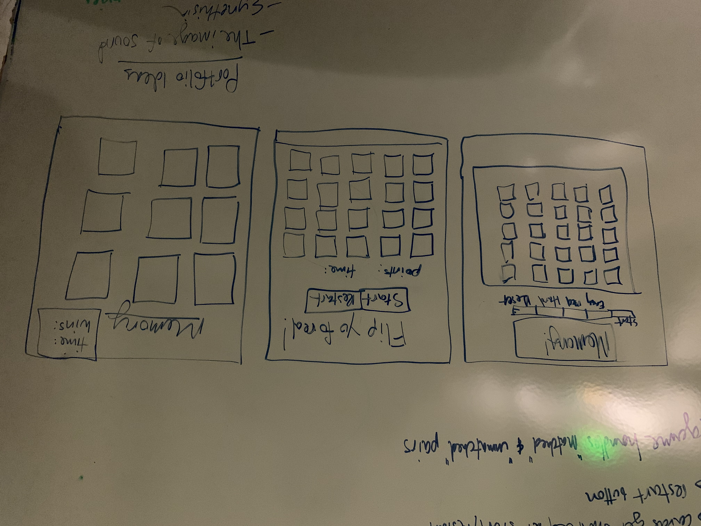
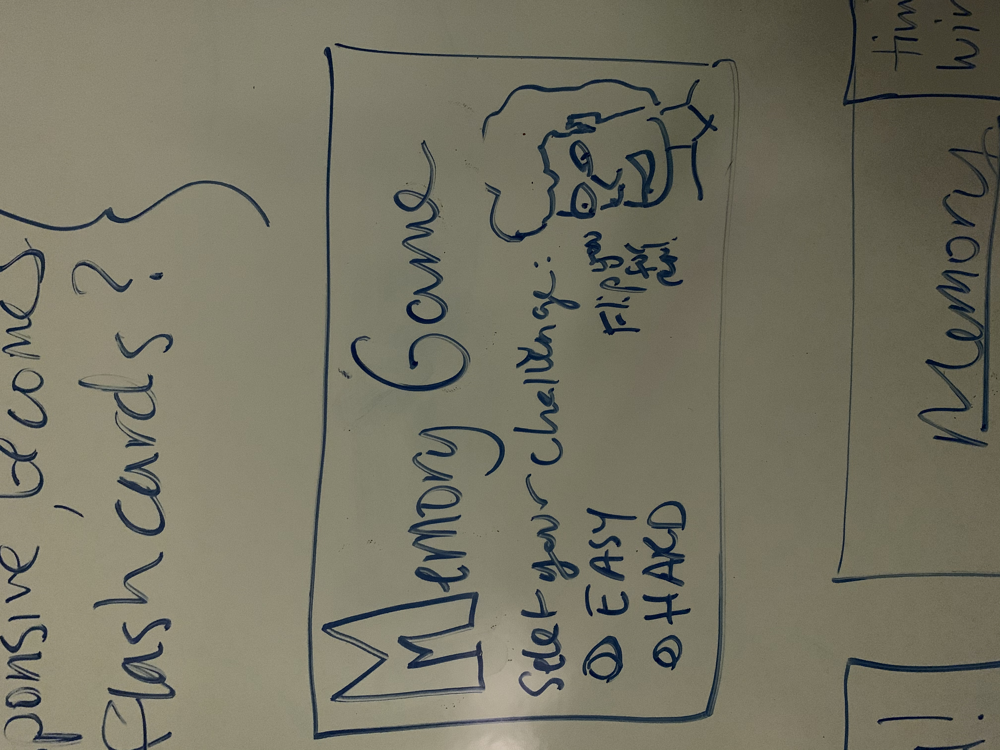
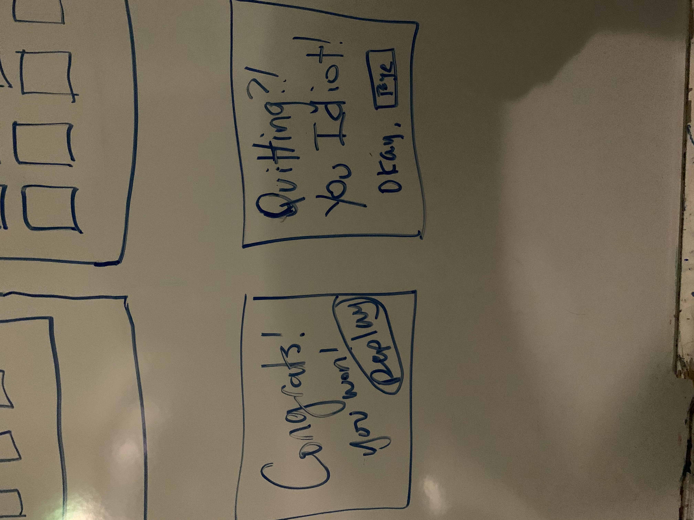

# Weekend
- [x] What did you achieve over the weekend?
- [x] What are your goals for today?
- [x] Do you have any blockers?
1. I planned out my game a little more by white boarding the HTML page and understading what elements I need.
2. Draft the index.html page, and begin styling content
3. I need to really lean in and define the game logic. That is not coming easy right now because I don't think I'm making asking the right specific questions. ONce I find those, I can code what I need.

Here's images of the white board, drawing out what I want to show.

# Monday
- [x] What did you achieve yesterday?
- [x] What are your goals for today?
- [x] Do you have any blockers?
1. RESPONSE
2. RESPONSE
3. RESPONSE

# Tuesday
- [x] What did you achieve yesterday?
- [x] What are your goals for today?
- [x] Do you have any blockers?
1. RESPONSE
2. RESPONSE
3. RESPONSE

# Wednesday
- [x] What did you achieve yesterday?
- [x] What are your goals for today?
- [x] Do you have any blockers?
1. RESPONSE
2. RESPONSE
3. RESPONSE

# Thursday
- [x] What did you achieve yesterday?
- [x] What are your goals for today?
- [x] Do you have any blockers?
1. RESPONSE
2. RESPONSE
3. RESPONSE

# Friday
- [x] What did you achieve yesterday?
- [x] What are your goals for today?
- [x] Do you have any blockers?
1. RESPONSE
2. RESPONSE
3. RESPONSE

